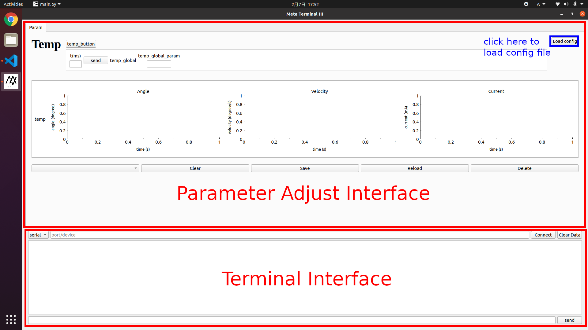
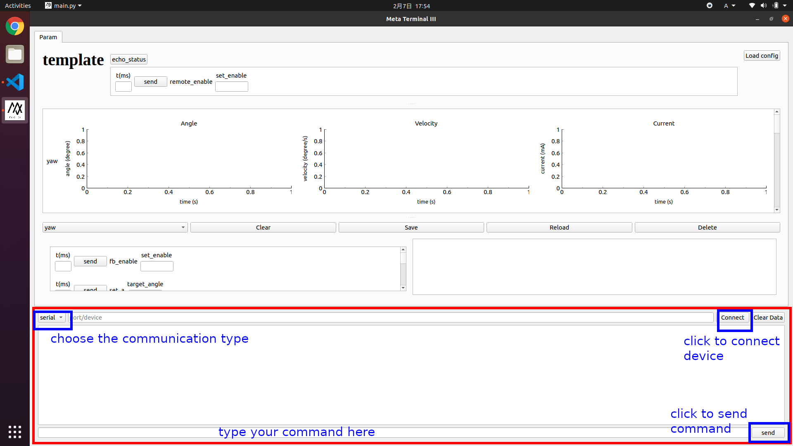
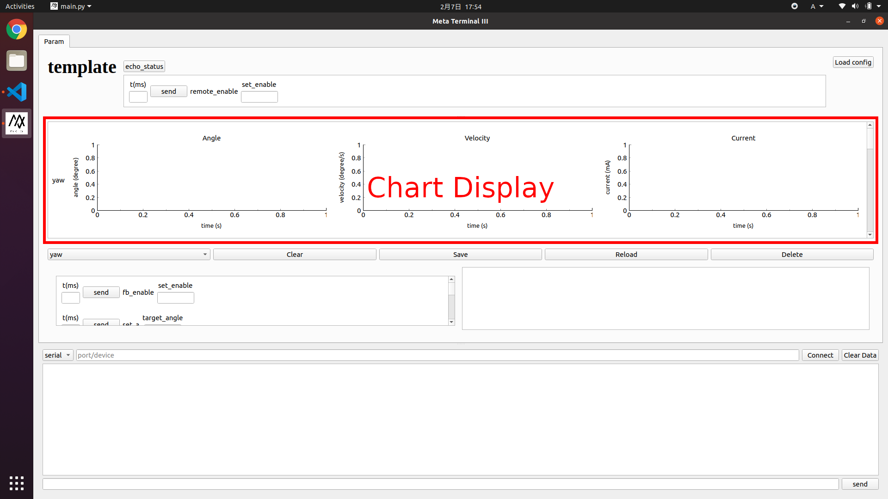
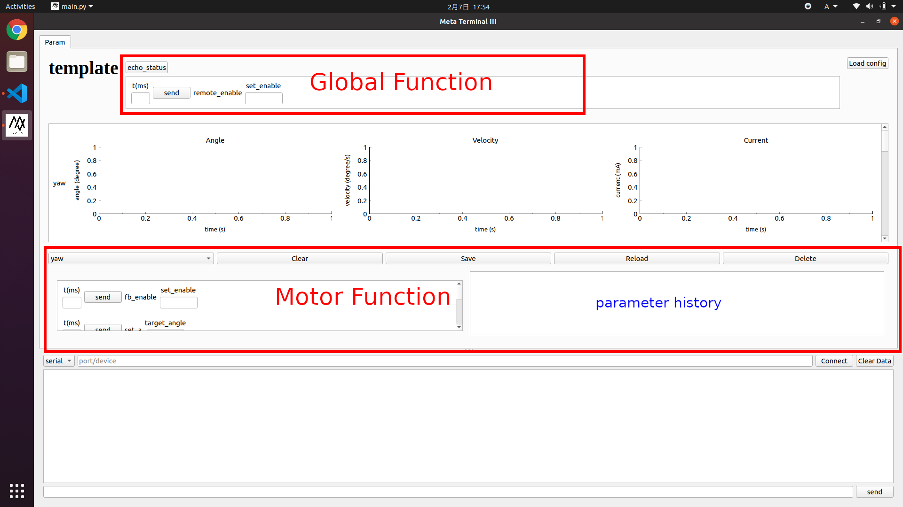
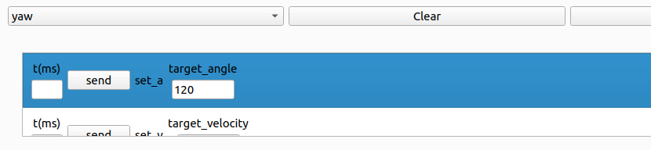
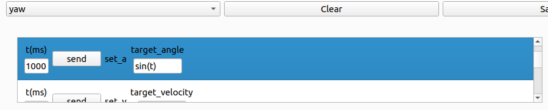

# Meta-Terminal III

> This is the source code for the Meta-Terminal III. The Meta-Terminal III is a tool that helps the Meta Team adjust parameters with configurable interface. This tool is written in python with the modules from PyQT5.

You can run the tool from the source code by typing

```shell
python3 main.py
```

in your computer terminal under the present directory.

## Install Requests

```bash
pip3 install -r requirements.txt
```


## Use of configuration file

The configuration file helps you define your testing interface. There are some presevered keywords and you can define your own parameters and commands so long as you follow the rules. The configuration file must be consistant with the test code and you should double check before running testing.

### Preserved keywords

+ **project**: The name of the test, not important.
+ **motor_config**: A list of configurations for each motor.
+ **motor_id**: The id of the motor. The number will be fit into the command indicating the motor to which the command is sent. id should be unique and consistant with your code.
+ **motor_name**: The name for the motor, marking the motor in the interface.
+ **commands**: Put any other commands that you will need in your testing here.
    + If the command may be used for each motor seperately, set the first parameter **"motor_id"**. 
        + For example, command "fb_enable motor_id set_enable" will be placed under each motor with only one input parameter *set_enable*.
    + If the command is only for one or more but not all motors, list the motor names in the command and put a **"->"** before the names start.
        + For example, command "a2v_enable motor_id set_enable -> yaw pitch bullet" will only be placed under *yaw*, *pitch* and *bullet*. 
    + If the command has neither **"motor_id"** in the first place nor a **"->"** in the middle, the command will be considered as a global command.
        + For example, "remote_enable set_enable" will be considered as a global command.

## Format of feedback

For the convenience of graphic display, the feedback should follow some patterns:

+ For the **motor feedback** message, the feedback should follow the pattern of **"fb \[motor_name] \[angle] \[target_angle] \[velocity] \[target_velocity] \[current] \[target_current]"** (replace the value in "[]" with real value). Make sure that each feedback message has **6 numerical parameters**, fill up the parameters with 0 if you have no value for it. The **\[motor_name]** should be consistant with the **motor_name** in your configuration file.
    + For example, the feedback could be "fb yaw 356.7 360.0 3.7 4.5 0 0".
+ For the **pure textual** message, please avoid starting with "fb".

> An example of configuration file *template.json* and test file *pa_example.cpp* can be seen in the *example* folder.

## Interface Introduction



1. After typing ```python3 main.py``` in the terminal, you can see the above interface. The general interface consists of two parts:
    + **Parameter Adjust Interface**: The main interface where you set commands and visualize the motor feedback.
    + **Terminal Interface**: The interface where you setup connection with the device and send command manually.
    + Click the "Load config" button to load the configuration file.
    + Click "Export" button (Under the "Load config" button, not shown in the image) to export all the data.



2. In the **Terminal Interface**, choose a device as you communication tool, fill the port name(for serial) or device ip(for tcp) and click **connect** to setup the connection. The **connect** button will become **disconnect** if connection is completed. The big white block in the middle displays the terminal message. You can type command in the input block at the bottom and send by clicking **send** button.



3. The **Chart Display** displays the motor feedback. In the each chart, the red line represent the target value and the blue line represent the actual value.





4. There are two function blocks: Global Function and Motor Function. Global Function contains commands that are not motor-specific, and Motor Function contains commands that are motor-specific.
    + Commands with no parameter are shown as buttons; commands with parameters are shown as lines of inputs and a send button.
    + In the Motor Function block, choose the motor and operate each motor seperately.
    + Select command lines and click **Clear** to clear parameters.
    + Select command lines and click **Save** to save the parameters to history.
    + Select history lines and click **Reload** to reload the history.
    + Select history lines and click **Delete** to delete the history.
    + The parameter could be either a *constant* or a *python expression* (see the second and third figure).
        + If the **t(ms)** input is left blank, click the **send** button will send the command once (parameter must be a constant value, not python expression).
        + If the **t(ms)** input is filled with a time duration in ms (1 sec = 1000 ms), click the **send** button will constantly send the command during the length of time with the interval of 20 ms. The value could be a constant or a python expression taking only **t** as the variable. The unit of t is also in ms.
        + **Notice that the target value will not be set to 0 after the time duration, so be careful when setting the velocity and current**
